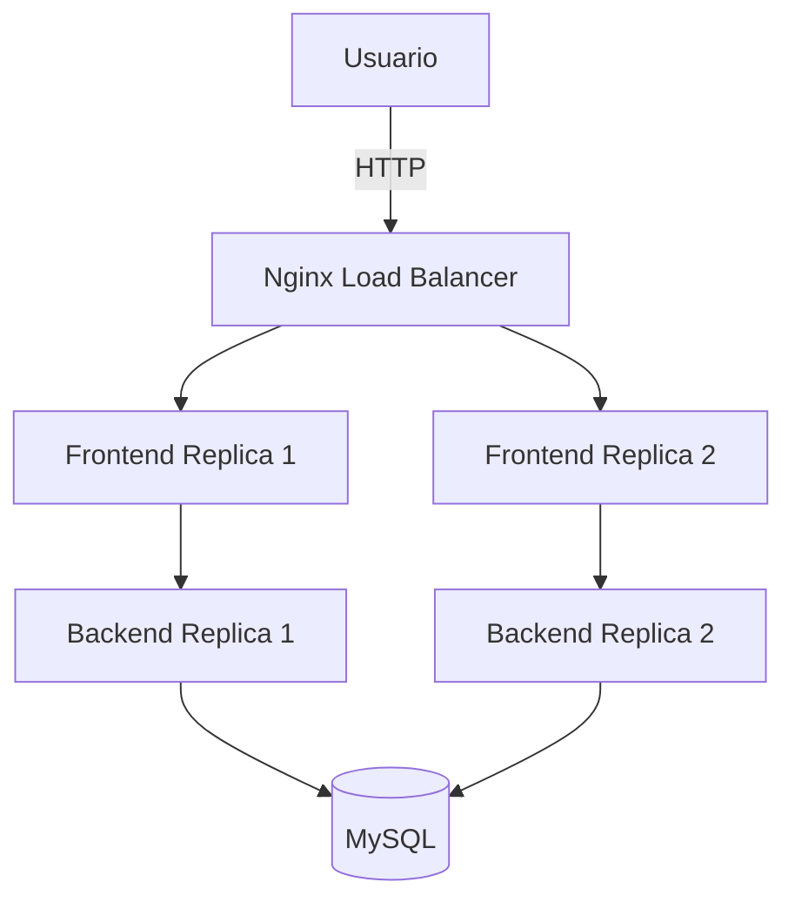

# Gestor de Gastos Personales (GESTORGASTOS)

## Integrantes del Grupo

* **BRENDA ALEJANDRA CUYUCHE PATZAN** - 3190-23-1771
* **HEYDY ANDREA OSCAL XITIMUL** - 3190-23-2724
* **STEPHANNY SUCELLY CARRANZA ESTUPE** - 3190-23-3321

---

# I. INTRODUCCIÓN

## Descripción del Proyecto

Gestor de Gastos Personales es una aplicación web desarrollada para administrar ingresos y gastos de manera sencilla y eficiente. Permite a los usuarios registrar movimientos financieros, consultar su historial y visualizar el balance general de sus finanzas en tiempo real.

La solución fue diseñada y desarrollada bajo una arquitectura de microservicios distribuidos, utilizando Docker para la contenerización, Nginx como proxy inverso y balanceador de carga, y Docker Swarm para la orquestación y alta disponibilidad de los servicios.

## Problema que Resuelve

Muchas personas llevan el control de sus finanzas personales de forma manual o mediante herramientas dispersas, lo que dificulta el seguimiento adecuado de ingresos, gastos y balances.

Esta aplicación resuelve dicho problema al centralizar la información financiera en una plataforma web accesible, automatizando el cálculo de saldos y garantizando la persistencia de los datos.

## Alcance

El alcance del proyecto comprende:

* Diseño de una arquitectura basada en microservicios.
* Desarrollo de una interfaz web para gestión financiera.
* Construcción de una API REST para la lógica de negocio.
* Implementación de operaciones CRUD para movimientos financieros.
* Configuración de despliegue mediante Docker Swarm.
* Balanceo de carga mediante Nginx.
* Comunicación segura entre servicios mediante red Overlay.

## Objetivo General

Diseñar, desarrollar y desplegar una aplicación web funcional basada en arquitectura de microservicios que permita la gestión de gastos personales utilizando Docker, Docker Swarm y Nginx para garantizar disponibilidad y escalabilidad.

## Objetivos Específicos

* Implementar una interfaz web intuitiva para el usuario.
* Desarrollar una API REST utilizando Node.js y Express.
* Utilizar MySQL como sistema de persistencia de datos.
* Contenerizar cada servicio mediante Docker.
* Orquestar los servicios mediante Docker Swarm.
* Aplicar balanceo de carga con Nginx.
* Garantizar la comunicación interna entre servicios sin utilizar localhost.

---

# II. TECNOLOGÍAS UTILIZADAS

## Frontend

* HTML5
* CSS3
* JavaScript (Vanilla JS)

## Backend

* Node.js
* Express.js

## Base de Datos

* MySQL 8

## Contenedores y Orquestación

* Docker
* Docker Swarm

## Balanceador de Carga

* Nginx

---

# III. ARQUITECTURA DE LA SOLUCIÓN

La aplicación está compuesta por cuatro servicios principales distribuidos y comunicados mediante una red Overlay de Docker Swarm.

Los servicios implementados son:

1. Frontend
2. Backend
3. Base de Datos MySQL
4. Nginx como Balanceador de Carga

## Diagrama de Arquitectura



---

# IV. ESTRUCTURA DEL PROYECTO

```text
GESTORGASTOS/
│
├── backend/
│   ├── db.js
│   ├── server.js
│   ├── package.json
│   ├── package-lock.json
│   └── Dockerfile
│
├── frontend/
│   ├── index.html
│   ├── login.html
│   ├── registro.html
│   ├── dashboard.html
│   ├── app.js
│   ├── styles.css
│   └── Dockerfile
│
├── nginx/
│   ├── nginx.conf
│   └── Dockerfile
│
├── database/
│   └── init.sql
│
├── stack.yml
├── docker-compose.yml
└── README.md
```

---

# V. DESPLIEGUE DEL PROYECTO

## 1. Inicialización de Docker Swarm
Si el clúster no está activo, inicialícelo en el nodo manager:
```bash
docker swarm init
---

# VI. COMUNICACIÓN ENTRE SERVICIOS

La comunicación entre servicios se realiza mediante la red Overlay de Docker Swarm.

Los servicios utilizan nombres internos para comunicarse entre sí:

* Backend → db
* Nginx → frontend
* Nginx → backend

Ejemplo:

```javascript
host: 'db'
```

De esta forma se cumple el requisito de comunicación interna entre contenedores sin utilizar localhost.

---

# VII. BALANCEO DE CARGA

El balanceo de carga es gestionado mediante Nginx y Docker Swarm.

La aplicación cuenta con:

* 2 réplicas del Frontend.
* 2 réplicas del Backend.

Docker Swarm distribuye automáticamente las solicitudes entre las réplicas disponibles.

El Backend registra en los logs el identificador de la réplica que atiende cada solicitud, permitiendo verificar la distribución de carga entre instancias.

---

# VIII. FUNCIONALIDADES IMPLEMENTADAS

## Gestión de Usuarios

* Registro de usuarios.
* Consulta de usuarios.

## Gestión de Movimientos Financieros

* Registrar ingresos.
* Registrar gastos.
* Consultar movimientos.
* Actualizar movimientos.
* Eliminar movimientos.

## Balance Financiero

* Cálculo automático del balance.
* Actualización dinámica de información financiera.

---

# IX. CONCLUSIONES

El desarrollo del proyecto permitió aplicar conceptos fundamentales relacionados con arquitectura de microservicios, contenerización y orquestación de servicios mediante Docker Swarm.

La utilización de réplicas para los servicios críticos y el balanceo de carga mediante Nginx permitieron mejorar la disponibilidad y escalabilidad de la aplicación.

Asimismo, la implementación de una base de datos persistente y la comunicación interna mediante redes Overlay demostraron el funcionamiento de una infraestructura distribuida moderna orientada a entornos reales.

Finalmente, el proyecto cumplió con los objetivos planteados al proporcionar una solución funcional para la gestión de gastos personales, integrando tecnologías ampliamente utilizadas en el desarrollo y despliegue de aplicaciones web.
